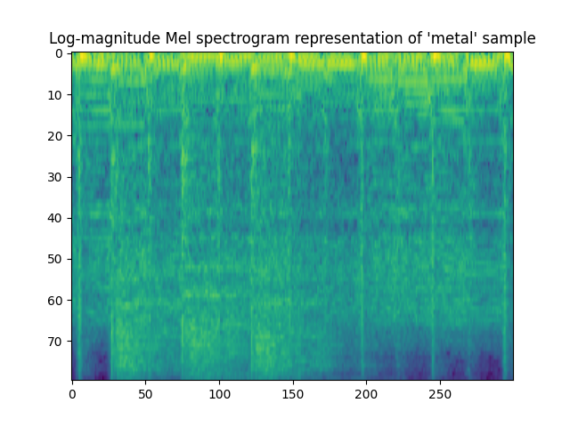

# Musical Genre Recognition
A LeNet-5 inspired convolutional network applied to the popular GTZAN musical genre dataset. Audio files are broken into slices of ~3 seconds, re-sampled to 16000 Hz, and an 80-channel log-magnitude Mel spectrogram representation is computed on 25-millisecond windows with a stride of 10 milliseconds.

